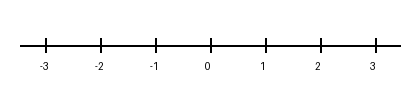

# Study notes

This note demonstrates images, note links and flashcards in BuddyPoint 1.7.0.

## A diagram

## Linked notes

[Equations](math.md)

[[advanced-math|Advanced equations]]

## Flashcards

What is the derivative of x²? :: 2x
How many arrangements of 3 different colours from 8? :: 8 × 7 × 6 = 336
When is a function continuous at a point? :: Its value is defined, its limit exists, and that limit equals its value.

Open the reader menu → Flashcards. Select a question, then Reveal to flip it.
Back returns to the questions; Back again returns to this note.
